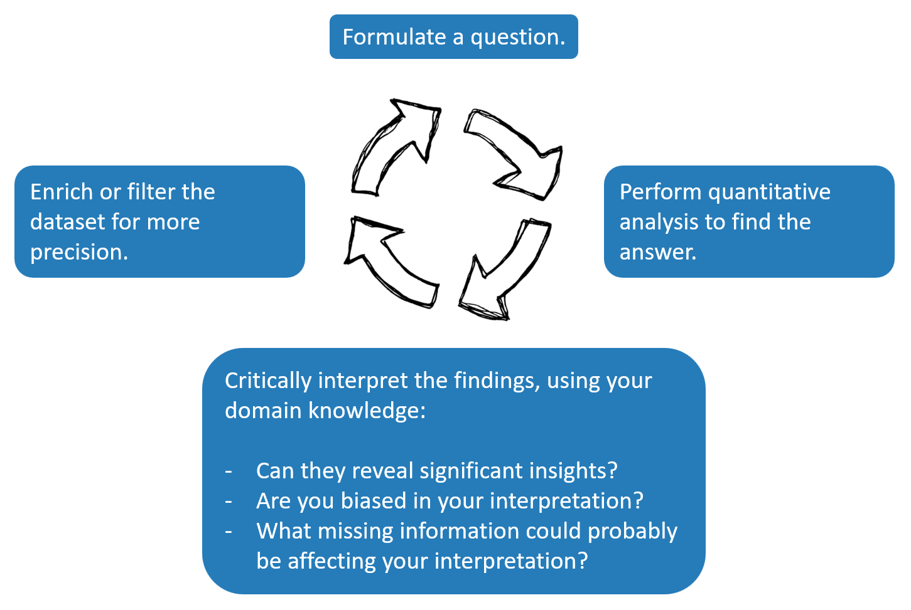

## Visit the website of MoMA
Click [this link](https://www.moma.org/) to visit the website of MoMa (Museum of Modern Art).

## Download the dataset
Click [this link](https://raw.githubusercontent.com/Goli-SF/uzh_demo/main/data/moma_artworks_geodata.zip) to download the dataset. Unzip the downloaded file on your computer.

## Download and install OpenRefine
Click [this link](https://openrefine.org/download) to download OpenRefine. Unzip the downloaded file on your computer and then run `openrefine.exe`.

## Use Kepler.gl for geospatial analysis
Click [this link](https://kepler.gl/) to start using Kepler.gl.

## Use Python for data visualization
Click [this link](https://mybinder.org/v2/gh/Goli-SF/uzh_demo/main?urlpath=%2Fdoc%2Ftree%2Fvisualize_mies_works.ipynb) to to create a bar chart displaying the count of Mies van der Rohe's works in the MoMA collection based on their creation date.

